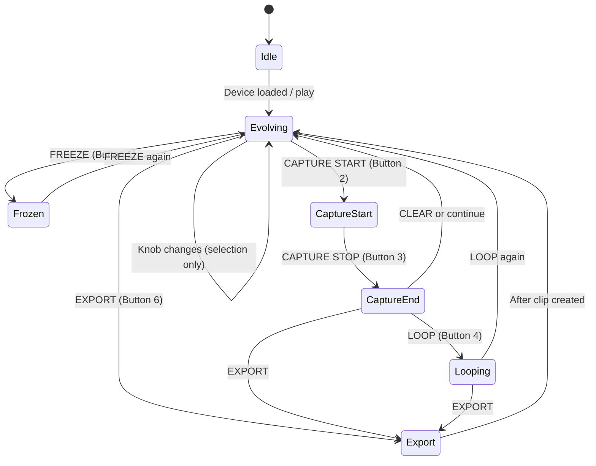
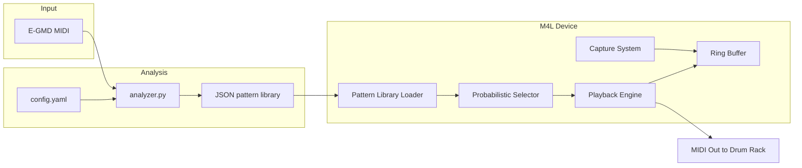

# Groove Wanderer Architecture

## Four-Layer System

The device operates on four independent drum layers, each with its own pattern stream:

1. **Kick** — Bass drum (MIDI 35, 36). Foundation; typically lowest complexity/density.
2. **Snare** — Snare/backbeat (37, 38, 40). Backbeat and ghost notes.
3. **Hats/Ride** — Hi-hats and ride (42, 44, 46, 51, 59). Timekeeping and texture.
4. **Percussion** — Toms, congas, etc. (41, 43, 45, 47, 48, 49, 52, 55, 57). Fills and color.

Each layer has its own complexity and change-rate knobs. Patterns are selected independently per layer, so kick can stay simple while snare evolves rapidly.

---

## Probabilistic Selection Algorithm (Pseudocode)

```
FUNCTION select_pattern(layer, target_complexity, target_density, chaos):
    patterns = library[layer]
    IF patterns is empty: RETURN null

    // Build weights: prefer patterns near target complexity/density
    FOR each p IN patterns:
        complexity_diff = |p.complexity_score - target_complexity|
        density_diff   = |p.density_score - target_density|
        base_weight   = 1.0 / (1.0 + complexity_diff + density_diff)
        // Chaos adds random variance (0 = deterministic tendency, 1 = random)
        weight[p] = base_weight * (1.0 - chaos) + random() * chaos
    END FOR

    // Weighted random choice
    total = SUM(weight[p] for all p)
    r = random(0, total)
    FOR each p IN patterns (order preserved):
        r -= weight[p]
        IF r <= 0: RETURN p
    END FOR
    RETURN patterns[last]
```

- **target_complexity / target_density**: From knob positions (0–127 mapped to 0.0–1.0).
- **chaos**: Master or per-layer parameter; higher values increase randomness vs. tendency.
- Selection runs per layer on bar boundaries (or at change-rate intervals).

---

## Ring Buffer Structure

- **Capacity**: 600 bars (e.g. ~5 minutes at 120 BPM, 4/4).
- **Unit**: One slot per bar. Each slot holds:
  - Bar index (or write position).
  - MIDI note events for that bar (note, velocity, beat-offset within bar).
  - Optional metadata (pattern ids per layer, tempo).
- **Write**: Circular. Current write index = `bar_number % 600`. New bar overwrites oldest.
- **Read**: Playback and capture read from the buffer by bar range; capture stores start/end bar indices and extracts that slice for MIDI clip creation.

---

## State Machine



- **Idle**: Device loaded, no transport.
- **Evolving**: Patterns selected and written to ring buffer; MIDI out active.
- **Frozen**: Evolution paused; current loop or last pattern holds.
- **CaptureStart / CaptureEnd**: Markers set; region defined for loop/export.
- **Looping**: Playback loops over captured region with optional mutation.
- **Export**: Create MIDI clip (or .mid file on long-press); then return to Evolving or Looping as appropriate.

---

## Data Flow: Analyzer → Library → M4L → MIDI Out



1. **Analyzer** reads E-GMD MIDI from `data/egmd/`, uses `config.yaml` for paths and analysis params. Outputs a single JSON **pattern library** (e.g. `analysis/output/pattern_library.json`) with keys `kick`, `snare`, `hats_ride`, `percussion`, each an array of patterns with id, source_file, complexity_score, density_score, pattern (beats, notes), metadata.
2. **M4L Pattern Library Loader** loads that JSON (e.g. into a live.dict), indexed by layer and optionally by complexity/density for fast lookup.
3. **Probabilistic Pattern Selector** uses knob-derived targets and chaos to pick patterns per layer; selected patterns feed the **Playback Engine**.
4. **Playback Engine** generates real-time MIDI (with velocity/humanization) and writes into the **Ring Buffer** by bar.
5. **Capture System** reads from the ring buffer using start/end bar markers and creates MIDI clips (or exports to .mid).
6. **MIDI Out** goes to the Drum Rack (or chosen track).
